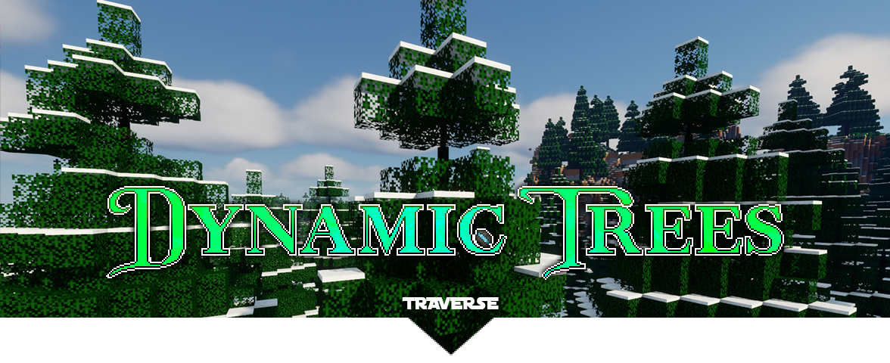

<h1 align="center">
Dynamic Trees for Traverse
</h1>

    
    

 
Dynamic Trees compatibility add-on for Traverse.  

This is a fork of [odorousrex's](https://github.com/odorousrex) [original project](https://github.com/odorousrex/DynamicTreesTraverse). 

## Download
Download at the [CurseForge page](https://www.curseforge.com/minecraft/mc-mods/dynamic-trees-traverse).

## Supported Trees
- Mini Jungle
- Fir
- Brown Autumnal Oak
- Orange Autumnal Oak
- Red Autumnal Oak
- Yellow Autumnal Birch

## Dynamic Trees +
[Dynamic Trees +](https://www.curseforge.com/minecraft/mc-mods/dynamictreesplus) is an optional dependency. When installed, any cacti from Traverse biomes will be replaced with the cacti from DT+. 

## Translations 🇫🇷 🇪🇸 🇲🇽 🇷🇺
Thank you to the people found [here](https://github.com/ferreusveritas/DynamicTrees/wiki/Translation-Credits) who spend their time creating and maintaining translations for this and other DT add-ons.

If you speak another language and would like to help, please [join the Dynamic Trees Discord](https://discord.gg/bGby2qxvqu).